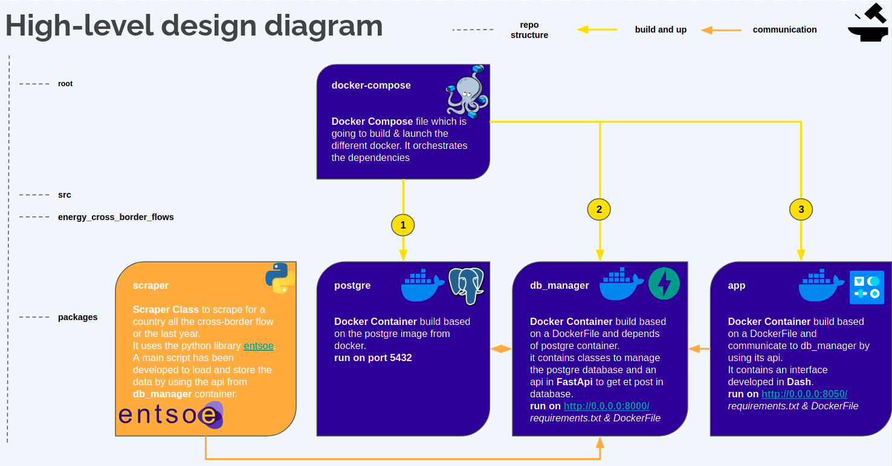

# energy-cross-border-flows

Repository for the `energy-cross-border-flows` app. Application to visualize the flows of energy between countries.

Table of Contents
=================

   * [dash-preprocessing](#dash-preprocessing)
      * [Summary](#summary)
      * [Installation](#installation)
         * [Git Clone](#git-clone)
         * [Docker-Compose](#docker-compose)
         * [Conda Environment](#conda-environment)
      * [Usage](#usage)
         * [Scraper](#scraper)
         * [Docker-Compose](#docker-compose-1)


## Summary

This repository included differentes packages to be able to run an application where user can vizualise the flow of energy between countries. The repository includes:

- `scraper`: Scraper class to scrape the data using the [entsoe-library](https://github.com/EnergieID/entsoe-py)
- `db_manager`: Database management classes with a api usinf [FastApi](https://fastapi.tiangolo.com/). It also included a DockerFile, so it can be deploy locally or on a docker container.
- `app`: The app has been developed in [dash](https://plotly.com/dash/). It also included a DockerFile, so it can be deploy locally or on a docker container.

The design of the application is the following:




## Installation

### Git Clone

- ```git clone https://github.com/MatthieuRu/energy-cross-border-flows.git``` *Git clone the project from Github.*

### Docker-Compose

- ```./start.sh``` *Build and Launch the docker-compose and then each docker images associate including the postgre server*
- ```./stop.sh``` *Stopes the docker images including the postgre server*

### Conda Environment
If need to you can also use a conda environment. It's taking in account all the requirement from all the packages.
- ```conda env create``` *Create the conda environment based on the environment.yml.*
- ```conda activate energy-cross-border-flows``` *Activate the conda environment.*

### Postgre Server

Once you have run the docker compose, you need to create the schema in the postgre database.
You can use the API db_manager:
- `http://0.0.0.0:8000/create-schema` to create the schema
- `http://0.0.0.0:8000/delete-schema` to delete in case you want to change the schema.

**Schema:**
```
create schema dexter;
CREATE TABLE dexter.energy_cross_border_flows (
  country_code_to varchar(2) not null,
  country_code_from varchar(2) not null,
  flow_timestamp timestamptz not null,
  capacity_mw integer not null,
  created_at date not null DEFAULT CURRENT_TIMESTAMP
);
SET timezone = 'Europe/Amsterdam';
create unique index "ci_flow_id_idx" on dexter.energy_cross_border_flows(country_code_to, country_code_from,flow_timestamp);
```

## Usage

### Docker-Compose

In this section we are not talking about the Scraper

1. The Postgre Server
You can use the config file, to know the credentials. if needed, you connect to the database by using any interface of data management. It's running on the localhost with port 5432. The database will be empty until you run the scraper `main.py`.

2. The db_manager x Endpoints
- `http://0.0.0.0:8000/create-schema` to create the schema
- `http://0.0.0.0:8000/delete-schema` to delete in case you want to change the schema.
- `http://0.0.0.0:8000/date/{date}/country/{country_a}/country/{country_b}` to query the data for a specifics date between two country


3. The app
Visit`http://0.0.0.0:8050/`.


All of the steps, bellow can be run **locally**.

1. The db_manager
The postgre server need to be running.
```
conda activate energy-cross-border-flows
cd src/energy_cross_border_flows/db_manage/
python main.py 0.0.0.0
```

1. The db_manager
The postgre server x the db_manager container need to be running.
```
conda activate energy-cross-border-flows
cd src/energy_cross_border_flows/app/
python app.py 0.0.0.0
```

### Scraper
```
Scraper Class which allow to scrape the data from enstoe, for a two specifics countries betwen now and a year ago.
```

The class is associate a to a script: `main.py`, which is runing a scraper for a list of countries in **scope** coming from a `config.yml`. You need to add as argument the api key provide by entsoe.
*The container with the Postrge & the db_manager need to be run to be able to store the data.*

To run the scraper:
```
conda env create
cd src/energy_cross_border_flows/scraper/
python main.py [api-key]
```